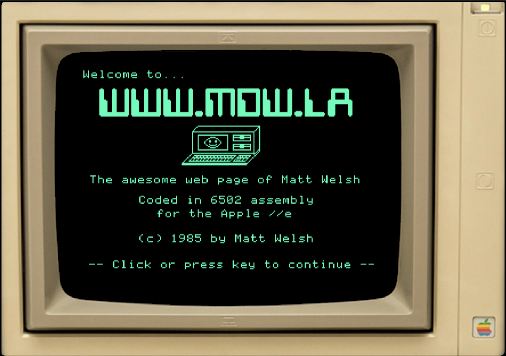

# MDWOS - A web page written in 6502 assembly language

Matt Welsh - https://www.mdw.la

## What is this?

This is a website written purely in hand-coded 6502 assembly
language. It is running on top of
[Apple IIjs](https://github.com/whscullin/apple2js), a JavaScript-based
Apple II emulator. I cannot take credit for Apple IIjs, of course.
This is just a little bit of 6502 assembly that I wrote to make a web
page, of sorts, running within the emulated Apple //e.

To try it for yourself, visit https://www.mdw.la/mdwos.

There are a couple of things interesting here, I think:

* I modified Apple IIjs to include native support for URL redirection.
  That is, you can point the emulated Apple II to a URL in its memory,
  and upon accessing a specific memory address, the browser running
  the emulator will open that URL in a new tab.

* To make it easier to show graphics on the Apple II, I wrote a bit
  of Python code which takes a standard image file (e.g., JPEG or PNG)
  as input, and generates amn Apple II-compatible high-res graphics
  memory image from it.

More details below.

## Background

As a kid, one of the first computers I owned was an Apple //e.
I loved this machine, with its 5.25" floppy drive, clunky beige
case, dot-matrix printer, the works. My eighth-grade science fair
project (roughly in 1987) involved writing a mouse-based paint program,
using the Apple II's lo-res graphics mode, in 6502 assembly!

A while back I came across
[Apple IIjs](https://github.com/whscullin/apple2js), which was a retro
hacker's dream: A fully-functional Apple II emulator running in the browser.
Apple IIjs is really slick. It emulates the Apple II *at the machine level*,
meaning, it directly emulates the display, keyboard, joystick or gamepad,
sound, floppy drives, and so forth, running the original Apple II ROM and disk
images on top of the emulated machine. It's brilliant. Pretty much every Apple II program I have tried runs perfectly on it. Even better, the code is very
clean and readable (hooray TypeScript!) and easy to extend. It is very well done.

At some point I came up with the idea of converting my personal website to
an emulated Apple II environment. I wanted to cheat as little as possible --
not just making the website *look* like an Apple II, but actually
*running* on an Apple II. MDWOS is the result. And even though there are
good C (and other high-level language) compilers available for the 6502,
I decided to write all of the code in 6502 assembly, just for the hell of it.
I'm not a very good assembly programmer, so the code is not as compact or
modular as I would like, but heck, it does the job.

## How it works

I'm not going to get into the details of Apple IIjs itself, there are plenty of details on [the Apple IIjs website](https://github.com/whscullin/apple2js).
However, building a bootable Apple II binary running on the emulator took a
bit of work, so I'll explain the process here.

As mentioned earlier, MDWOS is implemented in 6502 assembly. I use the
fantastic [ca65](https://cc65.github.io/doc/ca65.html) macro assembler,
which generates Apple II-compatible 6502 binary code. ca65 is available
for pretty much every platform (I'm using a Mac to develop this site).

ca65 (and its linker, ld65) are used to compile the source file
([mdwos.s](https://github.com/mdwelsh/mdwos/blob/main/mdwos/mdwos.s)) into
an Apple II executable. To run this (or any) program on the emulator,
we then need to write it to an Apple II-compatible disk image. For this, I use
[AppleCommander](https://applecommander.github.io/), which takes the
binary and writes it to the disk image file.

The file [empty.dsk](https://github.com/mdwelsh/mdwos/blob/main/mdwos/empty.dsk)
is an empty, Apple DOS 3.3 formatted floppy image, meaning it contains DOS
itself but no other program or file data. AppleCommander is used to write
the binary for my assembly program to the disk, along with a few other files:

* A text file called `HELLO`, containing an AppleSoft BASIC program to launch
  the binary program using the `BRUN` command. Apple DOS diskettes always
  run `HELLO` on boot, so this is simply a way to bootstrap into my binary.

* A couple of high-res graphics image files, as described below.

The MDWOS program itself is fairly simple. It basically shows a couple
of images, and allows the user to navigate through some text-based menus.

## Opening web links

The main feature I wanted for MDWOS was the ability for the emulated
Apple II program to open up URLs in the surrounding browser. For this,
I made a few modifications to Apple IIjs (found in this [git commit](https://github.com/whscullin/apple2js/commit/990d3655e785aed0b39c6ae4bfb438b22ba8bc02))
to allow the emulator to do this. The ideas is as follows: The 6502 program
writes the address (in the 6502's memory) of the URL to the two zero-page
locations at 0x6a and 0x6b. It then accesses the memory location 0x6c. This
triggers code hacked into the Apple IIjs emulator to read the URL out of the
emulated machine's memory and open that URL in a new browser tab.

## Using the mouse

I also wanted users to be able to click on links on the virtual Apple II screen.
Fortunately, Apple IIjs already translates mouse events in the browser into
the appropriate signals to emulate the Apple II paddles (yes!). Therefore, all
that MDWOS needs to do is read the paddle positions (using a `JSR $FB1E` call)
which will return a value between 0-255 representing the row or column that the mouse is on. Mouse clicks are translated to paddle button clicks, readable
via the high-order bit of memory location `$C061`. So mouse support is easy.

## Showing graphics

The Apple II has a notoriously weird graphics page layout. The mapping from
pixel (x, y) position to memory location is rather odd, as scanlines are
interleaved in a bizarre fashion (which, I believe, was intended to
allow the Apple II's graphics hardware to feed scanlines to the display at
a certain rate). To make life easier, I wrote a little utility called
[img2hgr.py](https://github.com/mdwelsh/mdwos/blob/main/img2hgr/img2hgr.py)
which takes a standard image as input, resizes it to the screen resolution
of the Apple II High Resolution Graphics display (a whopping 280x192 pixels)
and writes out a binary file containing the image data in the layout expected
by the Apple II. This file can then be loaded directly into memory address
`$4000` and the HGR mode enabled by calling `JSR $F3D8`. I actually call into
DOS and use the `BLOAD` AppleSoft routine for this, rather than trying to fiddle
with the disk and loading into memory directly from assembly. Hell, the OS is
there, might as well use it to do your dirty work...

## Resources

I cobbled this together over a few days relying on both many out-of-print
books and random websites. It's too bad that books like the *Apple IIe Technical
Reference Manual* costs $900 to buy used online (!) -- but the PDF is available
for [download](http://www.applelogic.org/files/AIIEREF.pdf).

* The [apple2.org.za mirrors](https://mirrors.apple2.org.za/) site has a lot
  of useful material, including [scans of many books and manuals](https://mirrors.apple2.org.za/ftp.apple.asimov.net/documentation/).

* [Assembly Lines: The Complete Book](https://www.amazon.com/gp/product/1312089407) is a really great reference for Apple II assembly programming.

* The [dos33fsprogs](https://github.com/deater/dos33fsprogs) repo has a lot
  of useful utilities and sample programs, mostly writen in 6502 assembly
  using ca65. 

* Of course the [Apple IIjs](https://github.com/whscullin/apple2js) code itself
  is a good reference for figuring out how the hell the underlying machine
  is supposed to work.

Feel free to [drop me a line](https://www.mdw.la) if you have any questions
or suggestions!
